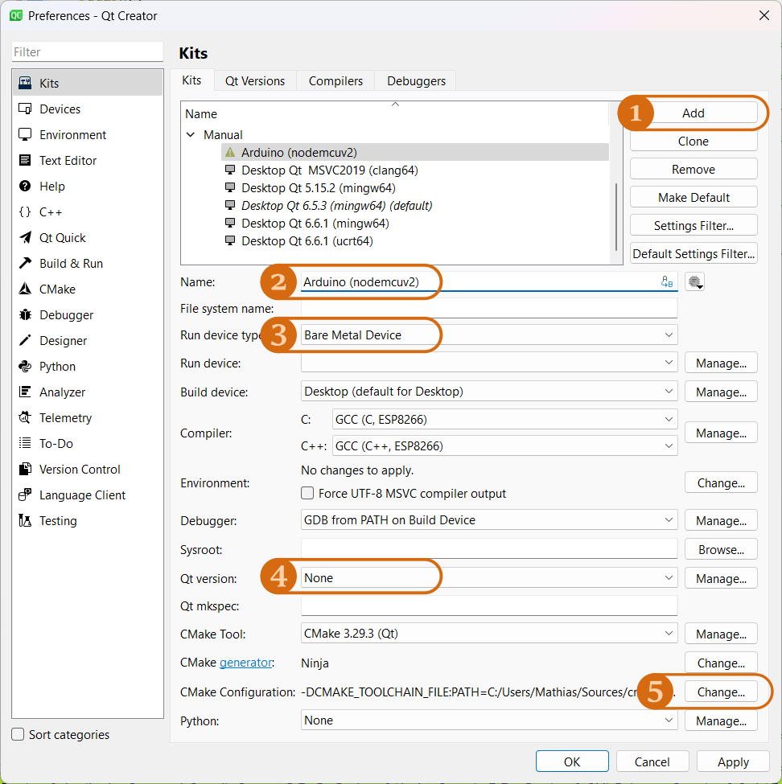
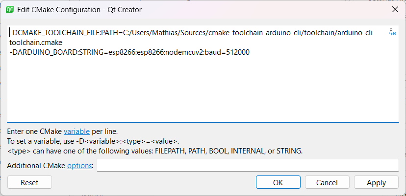
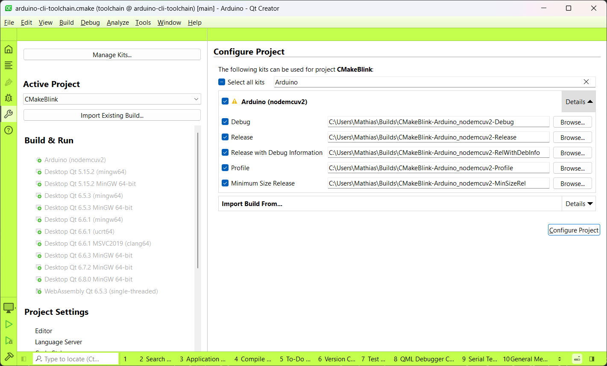

# CMake toolchain for Arduino CLI

How about using [CMake](https://cmake.org) to build your [Arduino](https://arduino.cc/) projects?

How about using `CMakeLists.txt` files as simple as this?

```CMake
cmake_minimum_required(VERSION 3.19)
project(CMakeBlink VERSION 0.1 LANGUAGES CXX)
add_executable(CMakeBlink CMakeBlink.ino)
```

This all can be done using [Arduino CLI](https://github.com/arduino/arduino-cli).
This  toolchain fully based upon this really great tool: There are no tricks, no hacks, 
no manual parsing  of obscure text files at undocumented locations. Just the official
API and some pretty straight forward CMake. That's the main principle of this toolchain
file, and that's what hopefully  makes it more robust than any other Arduino toolchain
file before *(— famous last words)*.

## Status

[](https://github.com/hasselmm/cmake-toolchain-arduino-cli/actions/workflows/Test-ArduinoAVR.yml)
[](https://github.com/hasselmm/cmake-toolchain-arduino-cli/actions/workflows/Test-ArduinoSAMD.yml)
[](https://github.com/hasselmm/cmake-toolchain-arduino-cli/actions/workflows/Test-ATTinyCore.yml)
[](https://github.com/hasselmm/cmake-toolchain-arduino-cli/actions/workflows/Test-ESP32.yml)
[](https://github.com/hasselmm/cmake-toolchain-arduino-cli/actions/workflows/Test-ESP8266.yml)
[](https://github.com/hasselmm/cmake-toolchain-arduino-cli/actions/workflows/Test-STM32.yml)

This project is in early development. So far it's a fairly successful proof of concept.

- There still are plenty of shorcuts and major FIXME comments in the scipts.
- The toolchain only has been successfully tested with the Ninja generator so far.
- CMake's MS-Build generator is known to fail.
- Most importantly one cannot add libraries yet.
- Annoyingly one still needs an `#include <Arduino.h>` in the main sketch.
- Many more problems, I guess...

Anyway, if you got some spare time, feel free to try out, to test, to give feedback,
to contribute.

## Usage
### General

In general just configure your project like this:

```Bash
cmake -S ~/Arduino/YourProject \
    --toolchain PATH-TO/arduino-cli-toolchain.cmake \
    -D ARDUINO_BOARD=arduino:avr:nano
```

The parameter `ARDUINO_BOARD` is mandatory and provides your device's FQBN to the toolchain.

For more information about the FQBN string, or so called "fully qualified board names" visit
the [Arduino CLI wiki](https://arduino.github.io/arduino-cli/1.0/FAQ/#whats-the-fqbn-string).

### QtCreator



1. add a new kit to QtCreator
2. name the new kit, e.g. "Arduino (board name)"
3. select "Bare Metal Device"
4. make sure no Qt version is selected
5. configure CMake's initial configuration



1. remove all old settings
2. select the toolchain: `-DCMAKE_TOOLCHAIN_FILE:PATH=/YOUR/PATH/TO/cmake-toolchain-arduino-cli/toolchain/arduino-cli-toolchain.cmake`
3. configure a board: `-DARDUINO_BOARD:STRING=esp8266:esp8266:nodemcuv2:baud=512000`



Here you go! You are ready to open CMake based Arduino projects in QtCreator.

## License

This toolchain file, its related tools, tests, and examples are provided by under the terms
of the [MIT License](LICENSE).

## Credits

This project would not have been possible without all the previous hard work
[Arduino-CMake-Toolchain](https://github.com/a9183756-gh/Arduino-CMake-Toolchain).
I took good inspiration from it, especially when it comes to making CMake's initial
compiler detection accept Arduinos very special binary layout.
